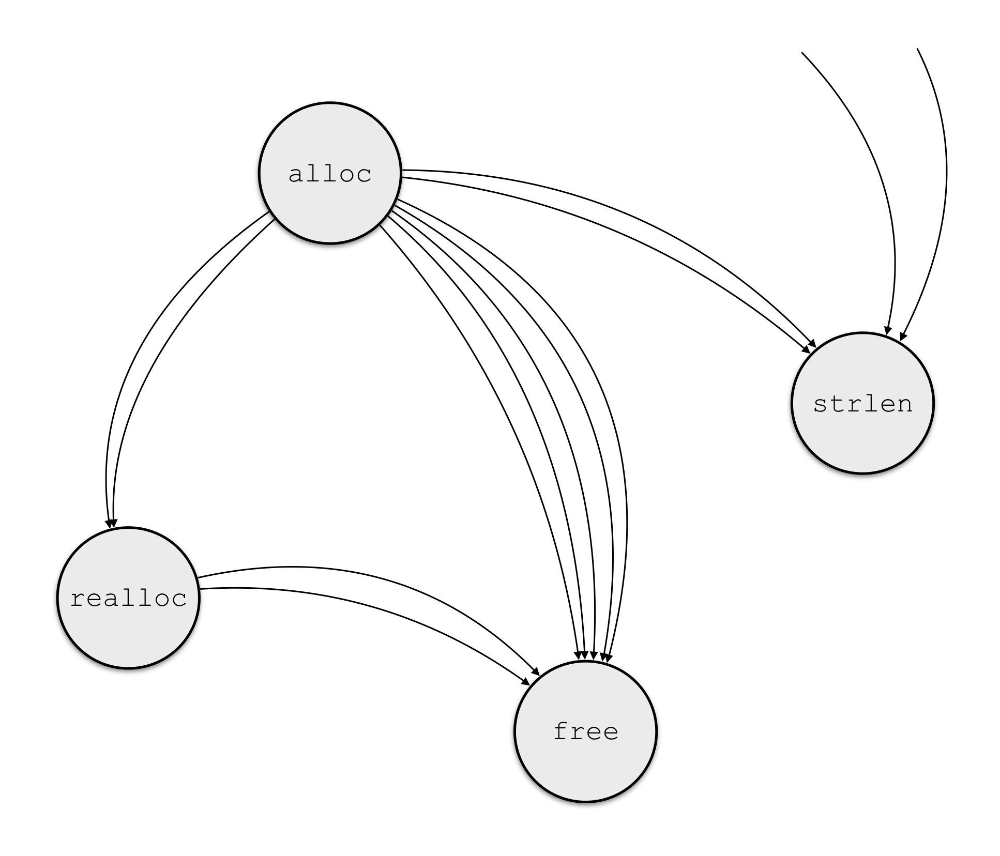
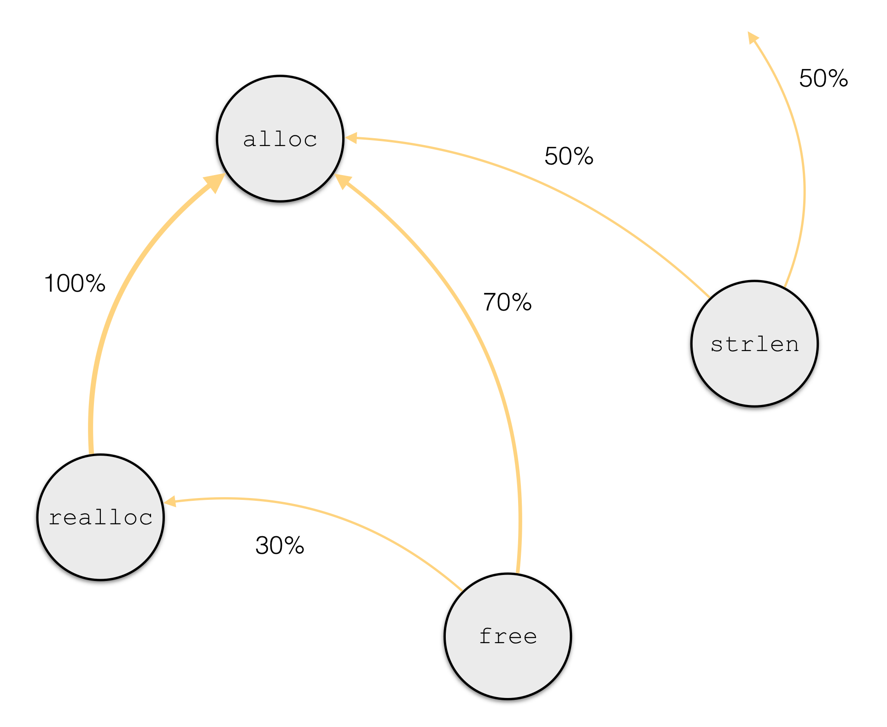

# scat

> «  Tell me! Everyone is picking up on that feline beat / 'Cause everything else is obsolete.

> \- Strictly high-buttoned shoes. »

[What is `scat`?](#what-is-scat)

[How does it work?](#how-does-scat-work)

[Some results obtained with `scat`](#some-results-obtained-with-scat)

[How to use it?](#how-to-use-it)

[Current limitations](#current-limitations-of-the-implementation)

## What is `scat`?

Originally, `scat` was a tool to recover high-level information about functions embedded in an executable
using **dynamic analysis**. In particular, `scat` aimed to recover:

* **arity** of functions
* **type** of arguments
* behavioral **coupling** between functions

Now, we've made `scat` more generic, and it handles several reverse-engineering functionalities, like allocator detection (WIP). 
It is also easy to add your own pintools to `scat` to perform your own analysis.

### Arity

By **arity**, we mean two things: first the number of parameters that a function takes,
and second if a function returns a value or not.

### Type

`scat` infers a simplified notion of type. We indeed consider only three possible ones: `INT`, `ADDR` and `FLOAT`.
We consider that they represent three different classes of variables that make sense semantically.
For instance, the size of an integer (`char`, `short`, `int`, `long int`) and weither it is signed or not
does not make a significant difference semantically.  

### Coupling

We also introduce a notion of *coupling* between functions. Intuitively, two functions are coupled if they
*interact* during the execution. `scat` is also able tor recover couples of functions from one execution.

#### What is coupling?

Let's take an example, with four functions (among others) embedded in a binary: `alloc`, `realloc`, `free` and `strlen`.
From an execution, we follow the values returned by those four functions, and see if they are given as a parameter to another
function.


**Figure 1 -** *Data flow between functions*

In **Figure 1**, an arrow from `A` to `B` means that one value returned by `A` was given as a parameter to `B`.
From this observation, what we want is to *invert* the information. It means that instead of knowing *where the
output goes*, we want to know *from where parameters come from*. So for each function, we compute the proportion
of times a parameter is a value returned by a particular function.


**Figure 2 -** *Coupling*

In **Figure 2**, we see that 70% of the parameters of `free` come directly from an output of `alloc`. Therefore, in this example
(meaning regarding this execution), `alloc` and `free` are coupled with a coupling coefficient of 0.7. In the same way, `realloc` and `alloc`
are coupled with a coefficient of 1.

#### What for?

Finding functions coupled with a high coefficient can have different interests.
For example, two functions that are always coupled with a high coefficient are `malloc` and `free`, or
more generally the allocating and the liberating functions of an allocator. Therefore, the notion
of coupling can be the first step to retrieve custom allocators embedded in binaries (for security purposes,
such as use-after-free detection).

#### Example with `scat`

```
scat > launch couple ./pgm/bin/mupdf-x11 ./testfile.pdf
[*] Launching couple inference on ./pgm/bin/mupdf-x11
[*] /usr/bin/pin/pin -t ./bin/obj-intel64/couple.so -o ./log/mupdf-x11_couple_1452528857.log -i ./log/mupdf-x11_type_1452528848.log -- ./pgm/bin/mupdf-x11 ./testfile.pdf
[*] Inference results logged in ./log/mupdf-x11_couple_1452528857.log

scat > display mupdf-x11 couple
...
(jsV_toobject, newproperty[2]) -- 0.986
(jsV_toobject, insert[2]) -- 0.976
(jsV_toobject, jsV_newobject[3]) -- 0.924
(jsV_toobject, jsV_setproperty[2]) -- 0.986
(jsV_toobject, js_pushobject[2]) -- 0.926
(jsV_toobject, jsR_defproperty[2]) -- 0.986
(jsU_bsearch, fz_new_pixmap_with_data[2]) -- 0.998
(jsU_bsearch, fz_new_pixmap[2]) -- 0.998
(jsU_bsearch, jsP_newnode[4]) -- 0.82

Information about inference
| Last inference:           1970-01-01 01:00:11
| Total number of couples:  899
| Unique left/right-side:   83/244
```

## How does `scat` work?

### General Idea
`scat` uses `pin` to instrument dynamically an execution of the program. During the execution,
we use heuristics on the use of registers and memory access to find arguments and retrieve types.
More about heuristics can be found in our [paper](paper/lightweight_heuristics_to_retrieve_parameter_associations.pdf).

### One execution (per recovery)
The goal of `scat` is not to recover information about every function embedded on the binary, but
to demonstrate the relevance of our heuristics in a lightweight way. for this reason, `scat` only
requires on execution for each of the three steps (**arity**, **type** and **couple**).

**Pros.** The inference is very lightweight.

**Cons.** Only functions that are executed at least one can be infered.

## Function identity

Because scat is also meant to be used with stripped binaries (i.e. binaries without function name)
A name-agnostic method is required to identify functions across all inferences. The solution choosen is to
identify them using the name of the binary file where they are defined and the static address (offset) in
this binary.

**Note**: if the binary is not stripped, function names are still available as meta-informations.

## Some results obtained with `scat`

Here are presented some results obtained with `scat` on several open-source libraries.
First, note that each result is a consequence of one single execution with standard inputs.
Second, the accuracy was obtained by comparison between results given by `scat` and the
source code of the binary under inference.

### Inputs used for test

* For emacs, we open a `C` source file of about 500 lines.
* For midori, we do not give any input (the browser automatically opens http://google.com/ when it starts).
* For MuPDF, we open a pdf of 67 slides generated with Keynote.
* For grep, we look for the expression "void" in a folder containing about 15000 files for a total of about 30 millions of lines.

### Arity inference

* #function is the number of functions detected during the one execution we ran.
* accuracy is the percentage of functions (that we detect) for which the arity we infered is consistant with the source code.

|              |  midori  |  grep  |  mupdf  |  emacs  |
|--------------|----------|--------|---------|---------|
| #function    | 4094     | 51     | 526     | 591     |
| accuracy (%) | 95.8     | 95.6   | 98.7    | 92.4    |


### Type inference

* #function is the number of functions detected during the one execution we ran.
* accuracy is the percentage of functions (that we detect) for which the type of each parameter we infered is consistant with the source code.

|              |  midori  |  grep  |  mupdf  |  emacs  |
|--------------|----------|--------|---------|---------|
| #function    | 4094     | 51     | 526     | 591     |
| accuracy (%) | 96.2     | 100    | 92.5    | 90.4    |

### Overhead

* #function is the number of functions detected during the one execution we ran.
* T0 is the time of execution with no instrumentation.
* T1 is the time of execution with arity inference.
* T2 is the time of execution with type inference.

|              | grep | tar  | a2ps |
| ------------ | ---- | ---  | ---- |
| size (KB)    | 188  | 346  | 360  |
| #function    | 46   | 101  | 127  |
| T0 (s)   | 0.80 | 0.99 | 0.80 |
| T1 (s)   | 1.70 | 2.64 | 31.6 |
| T2 (s)   | 1.06 | 1.79 | 13.2 |


## How to use it?

### Requirements

* `scat` requires **python 2.7** and is not compatible with **python 3**.
* You need to have `Pin` installed on your computer.
* If you want to test the results of inference (see [relative section](#accuracy-of-inference)), you also need to have `libclang1-3.4` installed.

### Installation

`$LOCAL_DIR` represents the path to where you want to download `scat`.

* Clone this repository: `git clone https://github.com/Frky/scat.git $LOCAL_DIR`
* (optional) Create a virtualenv for `scat`: `virtualenv ~/.venv/scat && source ~/.venv/scat/bin/activate`
* Install required python libraries: `pip install -r requirements.txt`

### Configuration

The configuration of `scat` is set in a yaml file, namely `./config/config.yaml`. You
can edit this file in order to fit with your own configuration. Main points are:

* `pin -> bin`: set the path to the `Pin` executable. Typical value for this is `/usr/bin/pin/pin` or `/usr/bin/pin/intel64/bin/pinbin`. **Required for `scat` to work correctly.**
* `pin -> path`: set the path to the `Pin` main directory. May be different from the path to the executable. Typical value for this is `/usr/bin/pin/`. **Required for `scat` to work correctly.**
* `log -> path`: set the path to the log directory.

### Error E: 4.3 is not a supported linux release

If you use an esoteric linux distribution (e.g. ArchLinux), it may not be supported by `Pin` explicitly.
If so, you can add the command line argument `-ifeellucky` to `Pin` by setting the entry `pin -> cli-options` in the configuration file.

### GCC >= 5.0 ABI compatibility (The C++ ABI of your compiler does not match the ABI of the pin kit.)

If you're linux distribution uses a recent gcc version, you may encounter this kind of errors when trying to compile the pintool.
To fix this, you can add the gcc flags `-fabi-version=2 -D_GLIBCXX_USE_CXX11_ABI=0` by setting the entry `pin -> compile-flags` in the configuration file.

#### Example of a configuration file

```
pin:
    path:   /usr/bin/pin
    bin: /usr/bin/pin/pin
    cli-options: -ifeellucky

pintool:
    arity:
        src: ./src/pintool/arity.cpp
        obj: ./bin/obj-intel64/arity.so
    type: 
        src: ./src/pintool/type.cpp
        obj: ./bin/obj-intel64/type.so
        prev_step: arity
    couple: 
        src: ./src/pintool/couple.cpp
        obj: ./bin/obj-intel64/couple.so
    alloc: 
        src: ./src/pintool/alloc.cpp
        obj: ./bin/obj-intel64/alloc.so

res:
    path: ./res

log:
    path: ./log

clang:
    lib-path: /usr/lib/x86_64-linux-gnu/libclang.so.1
    data-path: ./data/
```

### Basic usage

Run `scat` (from your virtualenv): `./scat.py`. You are now in th `scat` shell, where you can launch inference
on different binaries and display results.

### Make pintools

Before being able to launch any inference, you must compile pintools with the command make:

* make [-f] [-d] [-t] [pintools...]
where:
    - -f  --force  -B :    Force compilation even if already up to date
    - -d  --debug :        Compile in debug mode
    - -t  --trace :        Compile in trace mode (Warning: very verbose ! Mostly useful when debugging segfault)

Note: This actually use the os command make under the hood, thus tools will only be compiled after changes.

```
scat > make
[*] Compiling pintool: arity ...
[*]    => Done !

[*] Compiling pintool: type ...
[*]    => Up to date !

```

### Inference

To perform an inference driven by a pintool, use `launch` followed by the name of the inference (relatively to the configuration file).

Examples:

* `launch arity $PGM`: launch arity inference on `$PGM`, where `$PGM` is an executable and its arguments if any.
* `launch type $PGM`: launch type inference on `$PGM`. **Note** that it requires that arity inference was previously run on the same program.
* `launch couple $PGM`: launch couple inference on `$PGM`. **Note** that it requires that type inference was previously run on the same program.

```
scat > launch arity grep -r "def" ./src
[*] Launching arity inference on grep
[*] /usr/bin/pin/pin -t ./bin/obj-intel64/arity.so -o ./log/grep_arity_1451915233.log -- grep -r "def" ./
[*] Inference results logged in ./log/grep_arity_1451915233.log

scat > launch type grep -R "def" ./
[*] Launching type inference on grep
[*] /usr/bin/pin/pin -t ./bin/obj-intel64/type.so -o ./log/grep_type_1451915649.log -i ./log/grep_arity_1451915233.log -- grep -R "def" ./
[*] Inference results logged in ./log/grep_type_1451915649.log

```

### Results of inference

* `display $PGM $INF`: show the results of the last inference `$INF` on the program `$PGM`. `$INF` can be either `arity`, `type` or `couple`.

```
scat > display grep arity
('rpl_fcntl', 3, 0, 0, 1) [grep@0x421446]
('reset', 2, 0, 0, 1) [grep@0x40353b]
('safe_hasher', 2, 0, 0, 1) [grep@0x416c17]
('hash_delete', 2, 0, 0, 1) [grep@0x417ff4]
('dup_safer', 1, 0, 0, 1) [grep@0x421420]
('set_binary_mode', 2, 0, 0, 1) [grep@0x415585]
('kwsexec', 4, 0, 0, 1) [grep@0x413fd2]
...

Information about inference
| Last inference:           2016-07-19 15:06:15
| Total functions infered:  123
```

```
scat > display grep type
addr fts_alloc(addr, addr, int);
void pr_sgr_start_if(int);
int kwsexec(addr, addr, int, addr);
void setbit(int, addr);
void print_sep(int);
addr strcmp(addr, addr);
int tr(int, int);
int EGexecute(addr, int, addr, int);
int undossify_input(addr, int);
addr _dl_fixup(int, int);
...

Information about inference
| Last inference:           2016-07-21 14:53:05
| Total functions infered:  38
```

### Accuracy of inference

#### Requirements

#### Parse data from source code

In order to check the accuracy of inference, some metadata (mainly functions prototypes) needs to be retrieved beforehand for comparison. scat use two sources to retrieve these metadata :

  - Debug info stored in the binary using the dwarf debug format
  - Source code info using clang library for parsing

These two methods are more complementary than interchangeable as they both retrieve informations that the other does not.

**Pitfall**: For the accuracy command to work properly, the program has to be compiled in debug mode (For two reasons : to ensure all functions name are available and for the debug informations retrieval to work).

* `parsedata $BIN [$SRCPATH]`: launch retrieval of informations on given binary.

  - `$BIN` can either be the program for which the inference has been run or one of its libraries
  - `$SRCPATH` (optional) path of the source code of the program

```
scat > parsedata ./pgm/bin/glibc-obj/libc.so.6
scat > parsedata ./pgm/bin/grep ./pgm/src/grep/
```
**Note:** results are stored in `./data/` as python pickled files.

#### Check inference results

* `accuracy $PGM $INF`: compare meta-informations with results of inference
  - `$INF` (`arity` or `type`) on the program `$PGM`.

```
scat > accuracy grep arity
!! Missing data for libpcre.so.1
Information about inference
| Last inference:           2016-07-19 15:06:15
- Total functions infered:  123

Ignored
| Without name:            26
| Variadic:                3
| Pseudo-Functions:        1
- Not in binary/source:    0

Accuracy of inference
| Arity  Ok/Total tested:  87/93
| Return Ok/Total tested:  91/93
| Ratio arity:             93.55%
- Ratio return:            97.85%
```

#### List mismatches

* `mismatch $PGM $INF`:
    - `$INF` (`arity`) on the program `$PGM`.

```
scat > mismatch grep arity
!! Missing data for libpcre.so.1
Information about inference
| Last inference:           2016-07-19 15:06:15
- Total functions infered:  123

[libc.so.6@0xb3cc0] __getdents64 (int, char *, int) -> long
   Arity  : Expected 3 got 2
[grep@0x405527] grepfile (int, const char*, _Bool, _Bool) -> _Bool
   Return : Expected 1 got 0
[libc.so.6@0xdb8c0] do_fcntl (int, int, void*) -> int
   Arity  : Expected 3 got 2
[libc.so.6@0x11ea40] _dl_mcount_wrapper_check (void*) -> void
   Arity  : Expected 1 got 0
[ld-linux-x86-64.so.2@0x8f70] check_match (regmatch_t *, int, const char *, const char *, const char *) -> int
   Arity  : Expected 5 got 9
[libc.so.6@0xdb560] __write (int, void*, int) -> int
   Arity  : Expected 3 got 0
[libc.so.6@0x771b0] malloc_consolidate (mstate) -> void
   Return : Expected 0 got 1
[libc.so.6@0x242f0] __gconv_transform_ascii_internal (__gconv_step*, __gconv_step_data*, const unsigned char**, const unsigned char*, unsigned char**, size_t*, int, int) -> int
   Arity  : Expected 8 got 7
```

### Advanced usage

#### Add your own pintool

To add your own pintool, simply add an entry to the configuration file (typically `congig/config.yaml`). For example, let's say you want to add
a pintool named `nopcounter` to count the number of `NOP` instructions.

Here is what you should add to your configuration file:

```
pin:
    path:   /usr/bin/pin
    bin: /usr/bin/pin/pin
    cli-options: -ifeellucky

pintool:
    arity:
        src: ./src/pintool/arity.cpp
        obj: ./bin/obj-intel64/arity.so
    type: 
        src: ./src/pintool/type.cpp
        obj: ./bin/obj-intel64/type.so
        prev_step: arity
    couple: 
        src: ./src/pintool/couple.cpp
        obj: ./bin/obj-intel64/couple.so
    alloc: 
        src: ./src/pintool/alloc.cpp
        obj: ./bin/obj-intel64/alloc.so
+   nopcounter:
+       src: $SRC_DIR/nopcounter.cpp
+       obj: $OBJ_DIR/nopcounter.so

res:
    path: ./res

log:
    path: ./log

clang:
    lib-path: /usr/lib/x86_64-linux-gnu/libclang.so.1
    data-path: ./data/
```

where:

* `$SRC_DIR` is the path to the source file of `nopcount` 
* `$OBJ_DIR` is the path to the compiled shared library of `nopcount` 

And that's it. You don't need to actually compile your pintool, compilation will be handled by `scat`.

From now on, you can use the command `launch nopcount $PGM` within `scat` (be sure you ran `make nopcount` in `scat` before
to compile it).

## Current limitations of the implementation
`scat` comes with several limitations. Some of them are relative to the approach, but we will detail here only
the ones relative to incomplete or mis-implementation.

### Non object-oriented binaries only
For now, `scat` is not capable of performing inference on object-oriented programs. The reason of this is that `scat` relies on
the calling convention, and specificities introduced by object-oriented programs (and in particular *this call* convention)
have not been studied yet.

### Calling convention
As mentioned previously, `scat` relies on the knowledge of the calling convention. The approach proposed can be easily adapted to
any calling convention. However, the work has only been done for `x86-64 System V AMD64` calling convention. Therefore, only this kind
of binaries can be analysed for now.
